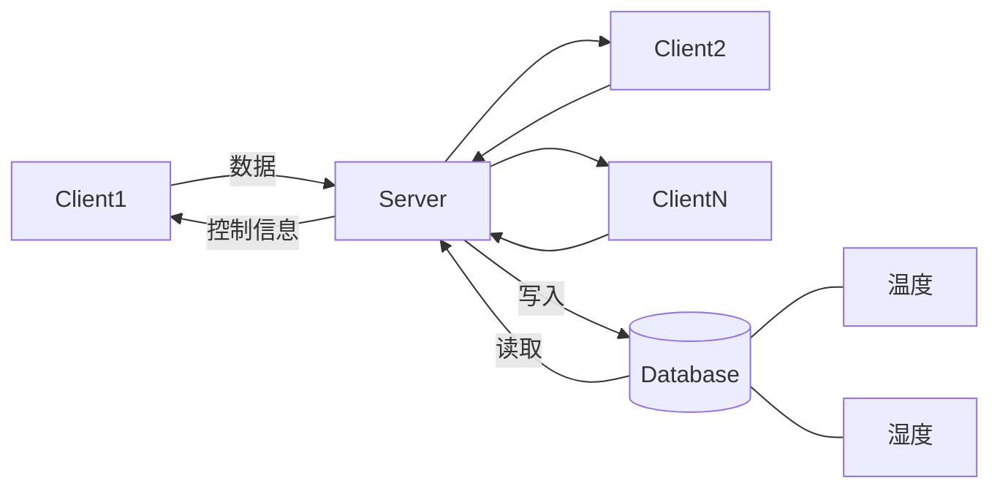

# 物联网综合实验-传感器数据模拟仿真系统

**要求**
1. 分为客户端与服务器端
2. 客户端可以有n个，服务器端只有一个
3. 客户端负责数据的采集，比如温湿度，压力，二氧化碳等并向服务端发送数据
4. 服务器端可以同时接受多个客户端的数据，并实时显示
5. 服务端可以控制客户端的操作，比如停止采集，采集数据的周期等
6. 服务器端将数据保存在数据库中，可以进行历史数据查询

注意点：
1. 对传感器的数据进行模拟，模拟的形式通过文件的读写来实现
2. 数据库使用python自带的sqlite3模块
3. 收发数据互不干扰，但又要共享数据，采用多进程
4. 开一个线程用来产生数据，用队列存放这个数据，此线程放一个，客户端取一个

设计思路：
1. 有一个传感器类